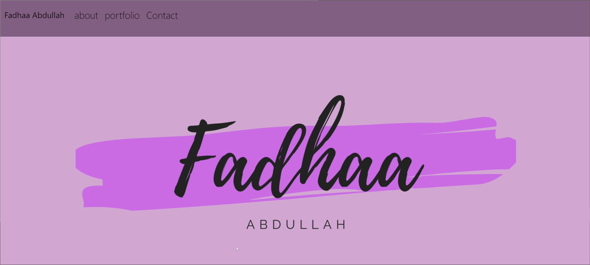

# Name 
Advanced CSS Challenge: Professional Portfolio
# requirments 
Use the Acceptance Criteria as a guide for how to plan deadlines, sketch, and code my portfolio.
# install
clone the repo
# example 

# how to join it 
the linces is under MIT 
# deployed
[fadhaa89.github.io/porfolio-1st](https://fadhaa89.github.io/portfolio-1st/)
# repo
[https://github.com/fadhaa89/portfolio-1st](https://github.com/fadhaa89/portfolio-1st)